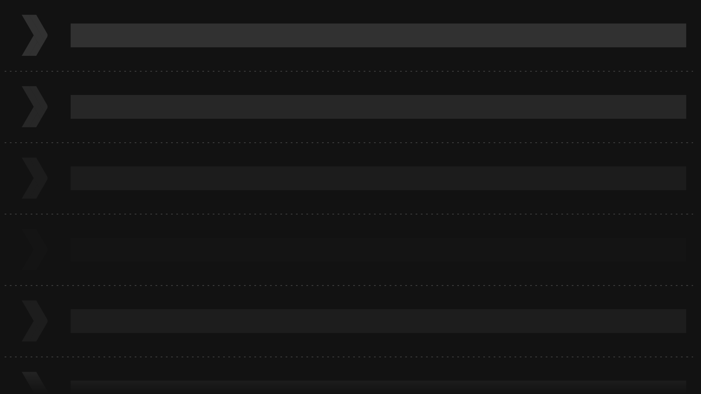

## GDG Search

Find GDG near you.

GDGs, or Google Developer Groups, are communities of developers that focus on Google technologies - including Android - around the world. They host lots of different events like meetups, conferences, study jams, and more!

The GDG Search app helps you locate GDGs around the world or start one of your own. You'll learn the principles of Material Design so you can implement professional looking designs and build Android apps that users love to use!

## Screenshots

